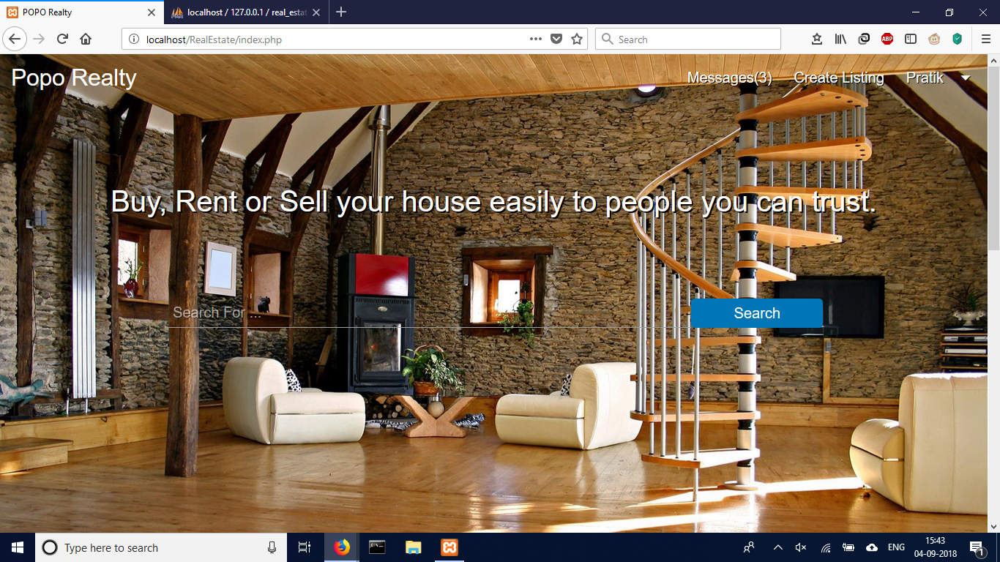
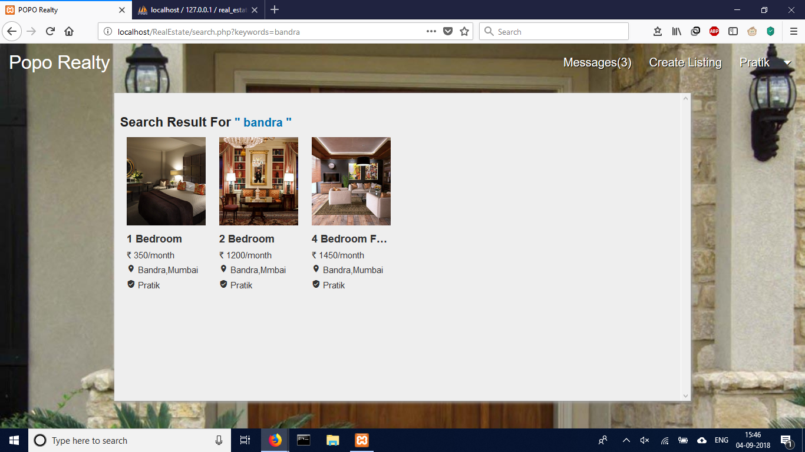
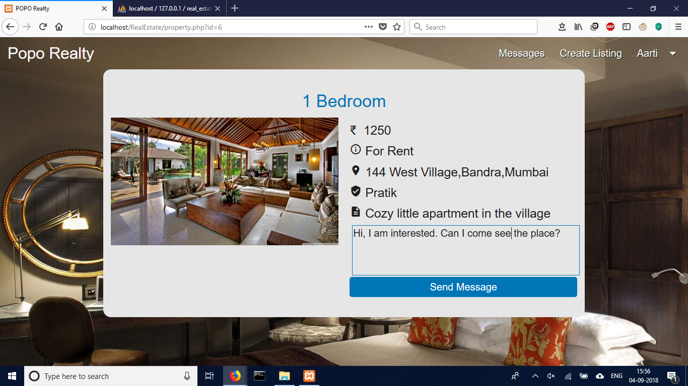
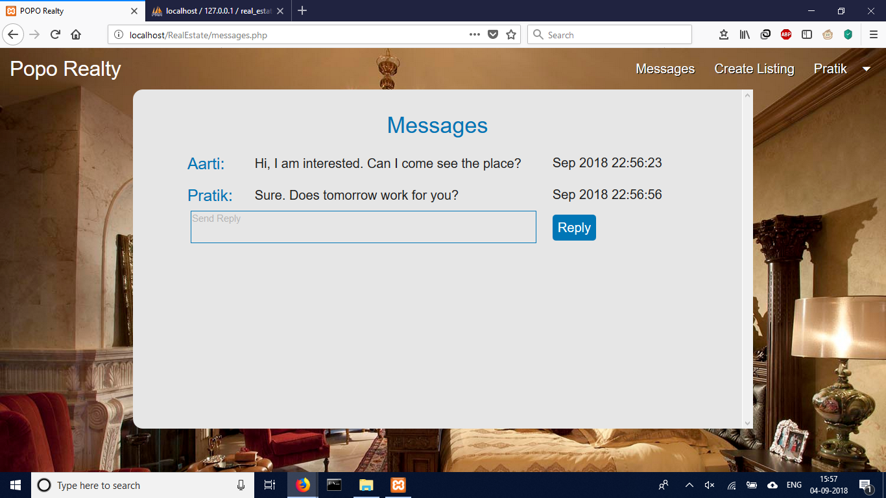
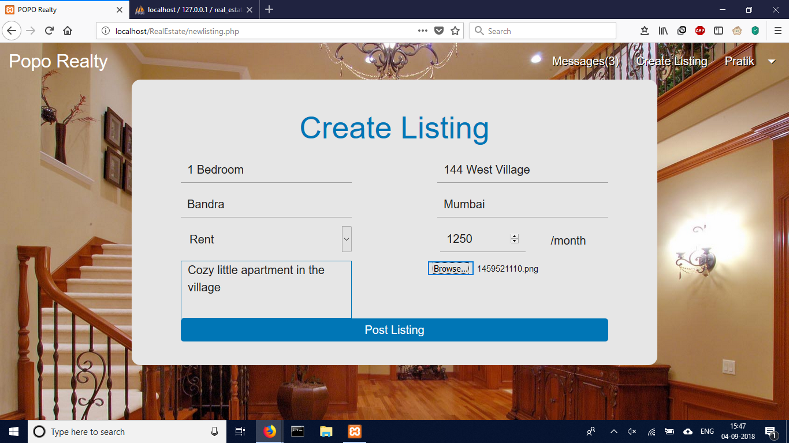

# Real Estate Management System

An online marketplace for buyers, renters and sellers to connect

## Key Features
- Users can search for apartments based on keywords
- Users can post listings to the website
- Ability to directly message interested seller from website
- Made use of a distributed database partitioned on location

## Screenshots of Site

HomePage: Simple UI for user to search for apartment

Result Page: All results matching users query

Individual Listing Page: View details about selected apartment

Message Page: View and reply to messages from within the website

New Listing: User can post a new listing on website

